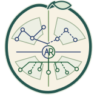
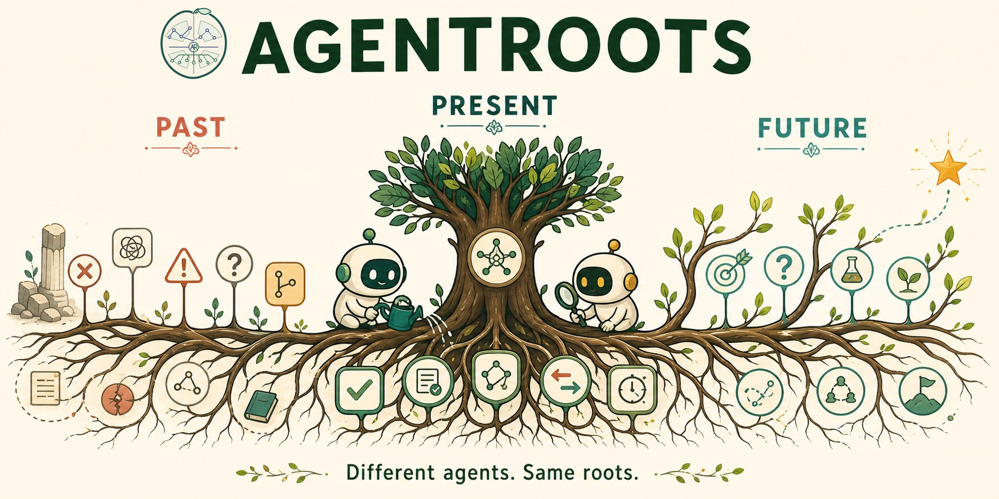
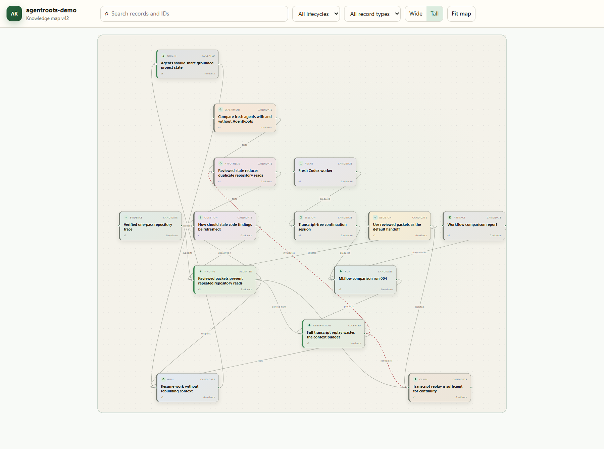

# AgentRoots

### Different agents. Same roots.

Evidence-governed continuity for agents that explore, build, and research together.

Built by Shanmukha Vellamcheti and
<a href="https://openai.com/codex/"> OpenAI Codex</a>.

<br clear="left">

Agents make exploration dramatically faster, but temporary contexts make useful work disposable.
Files get reread, failed paths get repeated, facts blur, and every fresh agent must reconstruct the
project's state. AgentRoots gives agents one durable, reviewed frontier instead.

**Memory preserves experience. AgentRoots governs the frontier.**



AgentRoots is an open-source Agent Continuity MCP for Codex, Claude, DeepSeek, and generic MCP
clients. It preserves where a project came from, what is currently supported, and what should
happen next, without replaying transcripts or duplicating large artifacts.

One agent can preserve useful state across sessions. Multiple agents can propose, review, and
reuse the same findings. AgentRoots does not spawn, schedule, route, or execute agents.

## See project state at a glance



This synthetic overview exercises all 14 record types and all 12 relationship types in the current
contract. The human-readable graph is generated from the same versioned event ledger that agents
query, making the complete project model inspectable without creating a second source of truth.

## Why I built AgentRoots

My research requires exploring many hypotheses and experimental paths. Before coding agents, the
number of experiments I could run manually was naturally limited. Agents changed that. They made
hypothesis exploration and project-state growth dramatically faster, but they also created a new
memory-management problem.

Modern agentic work increasingly depends on orchestrators and subagents for speed and cost
efficiency. That can multiply duplicated work. If an orchestrator assigns two independent tasks in
the same codebase, both subagents may reread the same files to understand the project, after the
orchestrator already read them to make the plan. The same knowledge may be reconstructed three
times. Across longer projects, context gets mixed, facts blur, failed paths are repeated, and the
latest working frontier becomes difficult to recover.

Memory tools preserve experience. Planning tools preserve intent. Provenance tools preserve what
ran and changed. AgentRoots connects those concerns as evidence-governed project state: what is
the project's origin, what is currently accepted, what evidence supports it, what is stale or
disputed, which goals remain active, and what questions or experiments should happen next. This
lets agents across models and harnesses inherit a compact, grounded frontier, then verify only what
their task requires instead of rebuilding the entire context from scratch.

I built AgentRoots because I needed agents to share more than memories. I needed them to inhabit
the same evolving state, avoid duplicated exploration, and continue from the real frontier.

## Why AgentRoots

AI agents are temporary. Their work should not be. AgentRoots preserves goals, questions,
hypotheses, experiments, observations, findings, decisions, failures, and evidence across
sessions, models, and harnesses.

Branches explore. Roots remember.

## Quick start

```bash
python -m pip install "agentroots @ git+https://github.com/shanmukha-here/agentroots.git"
agentroots propose demo hypothesis "Caching helps" "Latency should fall." --actor codex
agentroots-mcp
```

AgentRoots is not published to PyPI yet. Contributors cloning the repository can instead use
`python -m pip install -e .`. Python 3.11 or newer is required.

State defaults to the OS or XDG user data directory. Override it with `AGENTROOTS_DB` or
`--db`. The legacy `RESEARCH_STATE_DB` variable remains accepted for local migration. SQLite
runs in WAL mode. Generated state stays outside the repository.

## MCP surface

Tools: `research_get_context`, `research_get_frontier`, `research_query`,
`research_get_record`, `research_get_graph`, `research_propose`, `research_revise`, `research_review`,
`research_link_evidence`, `research_mlflow`, `research_sync`, and `research_validate`.

Resources: project brief, project frontier, record, and context packet under the
`research://` URI scheme. Protocol names remain research-specific because the initial ontology
models evidence-backed investigative work. AgentRoots branding covers its broader engineering,
research, and long-running agent uses.

Exact resource templates:

- `research://project/{project}/brief`
- `research://project/{project}/frontier`
- `research://record/{record_id}`
- `research://packet/{packet_id}`

Example MCP argument shapes:

```json
{"tool":"research_propose","arguments":{"project":"demo","record_type":"finding","title":"Cache result","body":"The cache reduced repeated reads by 12 percent in the measured workflow. The comparison used the same task fixture and code revision. This supports retaining the cache for subsequent trials. A replication should confirm the result on a larger repository.","creator":"codex"}}
{"tool":"research_review","arguments":{"record_id":"UUID","actor":"reviewer","verdict":"accepted","resolves_record_ids":["GOAL_UUID"]}}
{"tool":"research_link_evidence","arguments":{"record_id":"UUID","uri":"mlflow://runs/123","kind":"mlflow-run","actor":"reviewer","content_hash":"sha256-if-known"}}
{"tool":"research_get_context","arguments":{"project":"demo","query":"cache","token_budget":1500}}
{"tool":"research_mlflow","arguments":{"operation":"link","record_id":"UUID","run_id":"RUN_ID","actor":"reviewer","include_artifacts":true}}
```

`research_sync` imports supplied events, exports current project events, and can mark packet
record IDs as used. CLI `export` and `import` provide file-based JSONL transfer.

CLI query text is positional. Run `agentroots <command> --help` for command-specific arguments:

```bash
agentroots context demo "cache latency" --tokens 1500
agentroots validate demo
agentroots export demo events.jsonl
agentroots graph demo project-map.html
```

The graph command creates a self-contained, read-only React Flow knowledge map. It works offline
and supports automatic layouts, searching, lifecycle and type filters, pan and zoom, evidence
inspection, version metadata, relationship tracing, and copying record IDs for review or
correction. See [graph viewer architecture](docs/graph-viewer.md) for customization and the
governed editing roadmap.

On Windows, prefer these positional CLI commands or MCP tool calls over hand-escaped JSON in
PowerShell. For contributor tests in a clean checkout:

```bash
python -m pip install -e ".[dev]"
python -m pytest
```

Lifecycle: candidate to provisional to accepted, plus disputed, rejected, superseded, and stale.
Creators cannot accept their own proposals by default. Acceptance requires resolvable evidence.
Mutations emit append-only events. Stored text is always treated as untrusted data.
Substantive records should normally explain context, evidence, implications, and next steps in
three to five sentences. `research_validate` warns about thin provisional or accepted records;
set `metadata.concise_fact=true` only when a shorter statement is genuinely complete.
An accepted finding can explicitly resolve one or more goals. A `resolves` link removes those
goals from the active frontier while preserving their full history. `supports` does not close a
goal.

Implemented today:

- SQLite event ledger, revisions, projections, FTS5, and fuzzy lookup
- sectioned, token-budgeted, audited context packets
- review governance, contradictions, failed-attempt recall, and Git staleness
- exact JSONL event sync plus backup and restore
- read-only MLflow evidence integration and Trackio adapter
- H-E-F and signac importers
- stdio MCP server, CLI, schemas, tests, fixtures, and three-agent demo

Flowcept, AiiDA, PostgreSQL, remote HTTP, ACLs, and UI remain roadmap work. See the
[specification](docs/specification.md), [architecture](docs/architecture.md),
[integrations](docs/integrations.md), [roadmap](docs/roadmap.md),
[evaluation](docs/evaluation.md), and [demo](examples/three_agent_demo.py).

## Contributors

See [CONTRIBUTORS.md](CONTRIBUTORS.md). Contributions are welcome under Apache-2.0.
